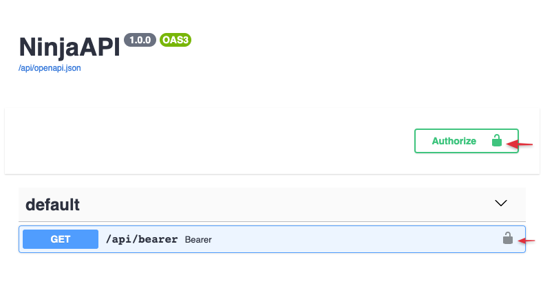
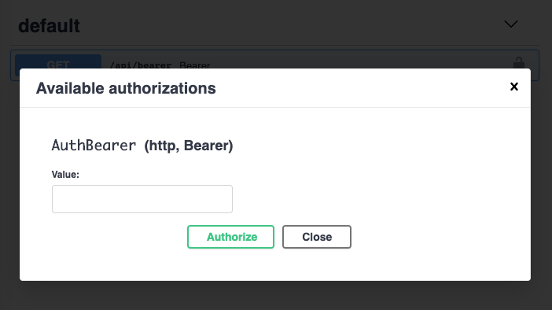

# Authentication

## Intro

**Django Hattori** provides several tools to help you deal with authentication and authorization easily, rapidly, in a standard way, and without having to study and learn [all the security specifications](https://swagger.io/docs/specification/authentication/).

The core concept is that when you describe an API operation, you can define an authentication object.

```python hl_lines="2 7"
{!./src/tutorial/authentication/code001.py!}
```

In this example, the client will only be able to call the `pets` method if it uses Django session authentication (the default is cookie based), otherwise an HTTP-401 error will be returned.

If you need to authorize only a superuser, you can use `from hattori.security import django_auth_superuser` instead.

## Automatic OpenAPI schema

Here's an example where the client, in order to authenticate, needs to pass a header:

`Authorization: Bearer supersecret`

```python hl_lines="4 5 6 7 10"
{!./src/tutorial/authentication/bearer01.py!}
```

Now go to the docs at [http://localhost:8000/api/docs](http://localhost:8000/api/docs).




Now, when you click the **Authorize** button, you will get a prompt to input your authentication token.



When you do test calls, the Authorization header will be passed for every request.


## Global authentication

In case you need to secure **all** methods of your API, you can pass the `auth` argument to the `HattoriAPI` constructor:


```python hl_lines="11 19"
from hattori import HattoriAPI, Form
from hattori.security import HttpBearer


class GlobalAuth(HttpBearer):
    def authenticate(self, request, token):
        if token == "supersecret":
            return token


api = HattoriAPI(auth=GlobalAuth())

# @api.get(...)
# def ...

# @api.post(...)
# def ...
```

And, if you need to overrule some of those methods, you can do that on the operation level again by passing the `auth` argument. In this example, authentication will be disabled for the `/token` operation:

```python hl_lines="19"
{!./src/tutorial/authentication/global01.py!}
```

## Available auth options

### Custom function


The "`auth=`" argument accepts any Callable object. Authentication is treated as successful whenever the callable returns any value other than `None`. That return value will be assigned to `request.auth`.

Use `None` to indicate that authentication failed or that the next authenticator in a list should be tried. Falsy values such as `0`, `False`, or `""` are still considered successful authentication results and will be stored on `request.auth`.

```python hl_lines="1 2 3 6"
{!./src/tutorial/authentication/code002.py!}
```


### API Key

Some API's use API keys for authorization. An API key is a token that a client provides when making API calls to identify itself. The key can be sent in the query string:
```
GET /something?api_key=abcdef12345
```

or as a request header:

```
GET /something HTTP/1.1
X-API-Key: abcdef12345
```

or as a cookie:

```
GET /something HTTP/1.1
Cookie: X-API-KEY=abcdef12345
```

**Django Hattori** comes with built-in classes to help you handle these cases.


#### in Query

```python hl_lines="1 2 5 6 7 8 9 10 11 12"
{!./src/tutorial/authentication/apikey01.py!}
```

In this example we take a token from `GET['api_key']` and find a `Client` in the database that corresponds to this key. The Client instance will be set to the `request.auth` attribute.

Note: **`param_name`** is the name of the GET parameter that will be checked for. If not set, the default of "`key`" will be used.


#### in Header

```python hl_lines="1 4"
{!./src/tutorial/authentication/apikey02.py!}
```

#### in Cookie

```python hl_lines="1 4"
{!./src/tutorial/authentication/apikey03.py!}
```

### Django Session Authentication

**Django Hattori** provides built-in session authentication classes that leverage Django's existing session framework:

#### SessionAuth

Uses Django's default session authentication - authenticates any logged-in user:

```python
from hattori.security import SessionAuth

@api.get("/protected", auth=SessionAuth())
def protected_view(request):
    return {"user": request.auth.username}
```

#### SessionAuthSuperUser

Authenticates only users with superuser privileges:

```python
from hattori.security import SessionAuthSuperUser

@api.get("/admin-only", auth=SessionAuthSuperUser())
def admin_view(request):
    return {"message": "Hello superuser!"}
```

#### SessionAuthIsStaff

Authenticates users who are either superusers or staff members:

```python
from hattori.security import SessionAuthIsStaff

@api.get("/staff-area", auth=SessionAuthIsStaff())
def staff_view(request):
    return {"message": "Hello staff member!"}
```

These authentication classes automatically use Django's `SESSION_COOKIE_NAME` setting and check the user's authentication status through the standard Django session framework.


### HTTP Bearer

```python hl_lines="1 4 5 6 7"
{!./src/tutorial/authentication/bearer01.py!}
```

### HTTP Basic Auth

```python hl_lines="1 4 5 6 7"
{!./src/tutorial/authentication/basic01.py!}
```


## Multiple authenticators

The **`auth`** argument also allows you to pass multiple authenticators:

```python hl_lines="18"
{!./src/tutorial/authentication/multiple01.py!}
```

In this case **Django Hattori** will first check the API key `GET`, and if not set or invalid will check the `header` key.
If both are invalid, it will raise an authentication error to the response.


## Router authentication

Use `auth` argument on Router to apply authenticator to all operations declared in it:

```python
api.add_router("/events/", events_router, auth=BasicAuth())
```

or using router constructor
```python
router = Router(auth=BasicAuth())
```

This overrides any API level authentication. To allow router operations to not use the API-level authentication by default, you can explicitly set the router's `auth=None`.


## Auth error responses

Auth classes declare their possible outcomes the **same way endpoints do** — via the return type annotation on `authenticate` (or `__call__` for custom auth classes that don't use `authenticate`). Each `APIReturn` subclass in the union contributes both runtime behavior and an OpenAPI response entry.

```python
from hattori import ApiError
from hattori.security import HttpBearer


class BadToken(ApiError):
    code = 401
    error_code = "bad_token"
    message = "Token invalid or malformed"


class ExpiredToken(ApiError):
    code = 401
    error_code = "token_expired"
    message = "Token has expired"


class AccountLocked(ApiError):
    code = 403
    error_code = "account_locked"
    message = "Account is locked"


class BearerAuth(HttpBearer):
    def authenticate(
        self, request, token
    ) -> "User | BadToken | ExpiredToken | AccountLocked":
        if not parseable(token): return BadToken()
        if expired(token):       return ExpiredToken()
        if locked(user):         return AccountLocked()
        return user
```

At runtime, returning an `APIReturn` instance from `authenticate` short-circuits to that HTTP response — the view is never called. Returning the auth-result type (here `User`) stores it on `request.auth` and proceeds to the view as usual.

In the OpenAPI spec, every operation using `BearerAuth()` automatically documents `401` (as a union of `BadToken` + `ExpiredToken`) and `403` (`AccountLocked`), alongside whatever responses the operation itself declares.

### What ends up in the spec

Only `APIReturn` subclasses in the return annotation contribute to the OpenAPI spec. An auth class with no annotation (or one containing only the auth-result type) adds nothing to each endpoint's response map.

```python
class SilentAuth(HttpBearer):
    def authenticate(self, request, token) -> "User":
        ...    # no auth errors documented on endpoints
```

### Return, don't raise

User code shouldn't raise to signal auth failure — `return` a typed `APIReturn` subclass. The return annotation is the contract, and raising sidesteps it. Things like `AuthenticationError` and `AuthorizationError` are framework-internal: hattori raises `AuthenticationError` itself when every registered auth callback returns `None` (i.e. "no auth matched"). That's the only case where those exception classes are in play; treat them as implementation detail, not public API.


## Custom exceptions

Raising an exception that has an exception handler will return the response from that handler in
the same way an operation would:

```python hl_lines="1 4"
{!./src/tutorial/authentication/bearer02.py!}
```


## Async authentication

**Django Hattori** has basic support for asynchronous authentication. While the default authentication classes are not async-compatible, you can still define your custom asynchronous authentication callables and pass them in using `auth`.

```python
async def async_auth(request):
    ...


@api.get("/pets", auth=async_auth)
def pets(request):
    ...
```


See [Handling errors](errors.md) for more information.
