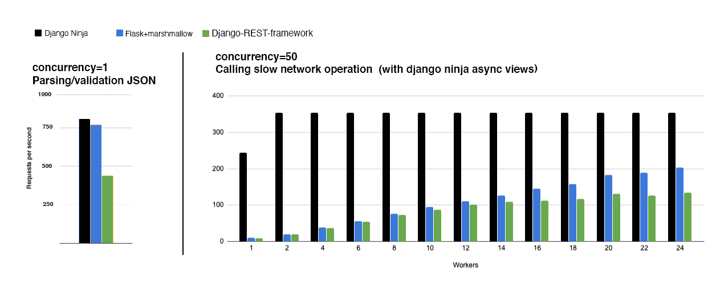
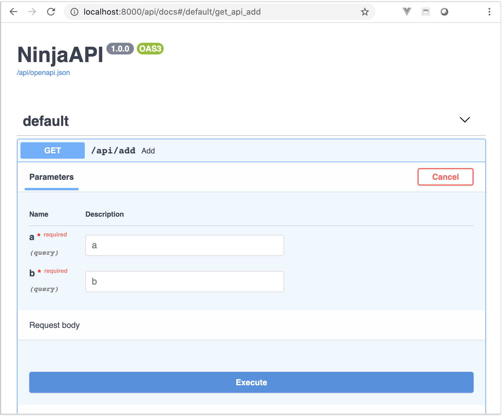

# Django Hattori - Fast Django REST Framework

Django Hattori is an opinionated fork of [Django Hattori](https://github.com/vitalik/django-hattori), a web framework for building APIs with Django and Python type hints.

Key features:

 - **Easy**: Designed to be easy to use and intuitive.
 - **FAST execution**: Very high performance thanks to **[Pydantic](https://pydantic-docs.helpmanual.io)** and **[async support](guides/async-support/)**.
 - **Fast to code**: Type hints and automatic docs lets you focus only on business logic.
 - **Standards-based**: Based on the open standards for APIs: **OpenAPI** (previously known as Swagger) and **JSON Schema**.
 - **Django friendly**: (obviously) has good integration with the Django core and ORM.
 - **Production ready**: Used by multiple companies on live projects.

[Benchmarks](https://github.com/0xff8c00/django-hattori-benchmarks):



## Installation

```
pip install django-hattori
```

## Quick Example

Start a new Django project (or use an existing one)
```
django-admin startproject apidemo
```

in `urls.py`

```python hl_lines="3 5 8 9 10 15"
{!./src/index001.py!}
```

Now, run it as usual:
```
./manage.py runserver
```

Note: You don't have to add Django Hattori to your installed apps for it to work.

## Check it

Open your browser at [http://127.0.0.1:8000/api/add?a=1&b=2](http://127.0.0.1:8000/api/add?a=1&b=2)

You will see the JSON response as:
```JSON
{"result": 3}
```
Now you've just created an API that:

 - receives an HTTP GET request at `/api/add`
 - takes, validates and type-casts GET parameters `a` and `b`
 - decodes the result to JSON
 - generates an OpenAPI schema for defined operation

## Interactive API docs

Now go to [http://127.0.0.1:8000/api/docs](http://127.0.0.1:8000/api/docs)

You will see the automatic, interactive API documentation (provided by the [OpenAPI / Swagger UI](https://github.com/swagger-api/swagger-ui) or [Redoc](https://github.com/Redocly/redoc)):




## Recap

In summary, you declare the types of parameters, body, etc. **once only**, as function parameters. 

You do that with standard modern Python types.

You don't have to learn a new syntax, the methods or classes of a specific library, etc.

Just standard **Python 3.14+**.

For example, for an `int`:

```python
a: int
```

or, for a more complex `Item` model:

```python
class Item(Schema):
    foo: str
    bar: float

def operation(a: Item):
    ...
```

... and with that single declaration you get:

* Editor support, including:
    * Completion
    * Type checks
* Validation of data:
    * Automatic and clear errors when the data is invalid
    * Validation, even for deeply nested JSON objects
* <abbr title="also known as: serialization, parsing, marshalling">Conversion</abbr> of input data coming from the network, to Python data and types, and reading from:
    * JSON
    * Path parameters
    * Query parameters
    * Cookies
    * Headers
    * Forms
    * Files
* Automatic, interactive API documentation

This project was heavily inspired by [FastAPI](https://fastapi.tiangolo.com/) (developed by [Sebastián Ramírez](https://github.com/tiangolo))
